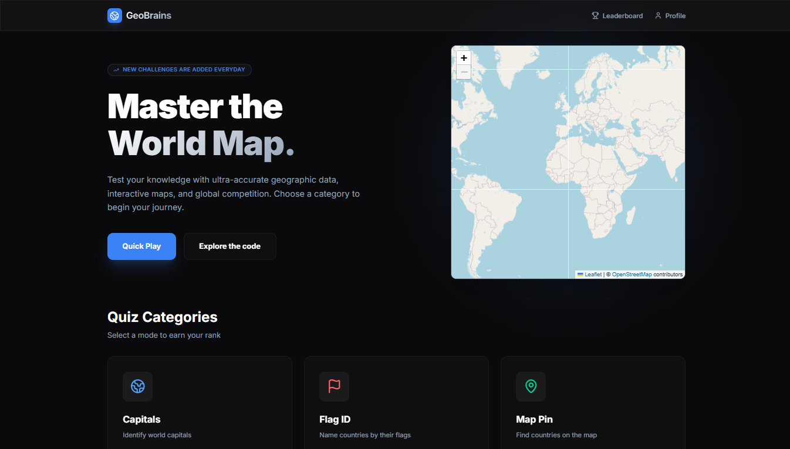
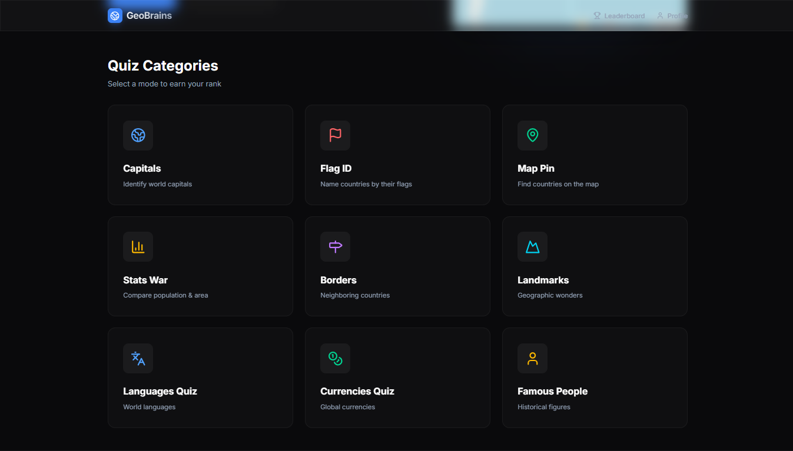
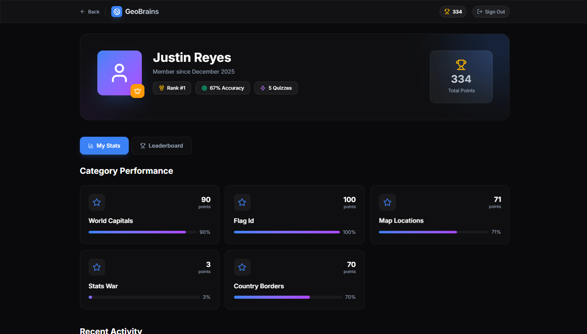
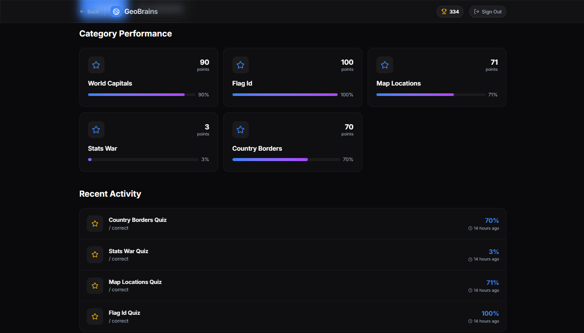
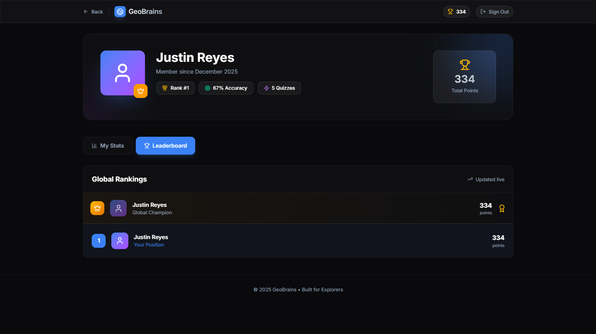
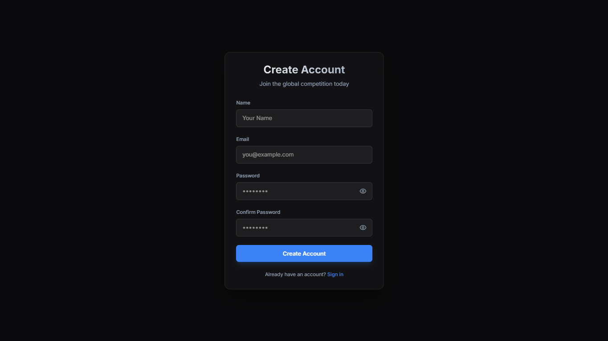

# GeoBrains 🌍 - Premium Geography Quiz Platform

GeoBrains is a sophisticated geography quiz platform that helps users test and improve their knowledge of world geography through interactive map-based quizzes. Built as a **pure Next.js 16+** application with **React 19**, it features a comprehensive quiz system, secure authentication with email verification, global leaderboards, and an admin dashboard for content management.

## ✦ Application Screenshots







## ✦ Key Features

### 🎯 Quiz Categories

GeoBrains offers 8 different quiz categories to test various aspects of geography knowledge:

- **Guess the Capital** - Identify capital cities of countries
- **Flag Quiz** - Recognize countries by their national flags
- **Map Pin Quiz** - Locate countries on an interactive map
- **Borders Quiz** - Identify countries by their geographic borders
- **Landmarks Quiz** - Recognize famous world landmarks
- **Famous People Quiz** - Associate notable figures with their countries
- **Currencies Quiz** - Identify national currencies
- **Languages Quiz** - Recognize official languages

### 🔐 Advanced Security Features

- **Email Verification** - 6-digit numeric code system with 10-minute expiration
- **Account Security** - Failed attempt tracking, account locking, and IP-based security
- **Audit Logging** - Comprehensive user activity tracking with timestamps and metadata
- **Role-Based Access Control** - USER and ADMIN roles with different permissions
- **Social Authentication** - Google OAuth integration for seamless login

### 📊 User Features

- **Interactive Profile Dashboard** - Track quiz performance across all categories
- **Global Leaderboards** - Compete with other users worldwide
- **Performance Analytics** - Detailed statistics and progress tracking
- **Responsive Design** - Optimized for both desktop and mobile devices

### 🎨 Premium UI/UX

- **Rich Visual Content** - High-quality images, smooth animations, and glassmorphism effects
- **Interactive Maps** - Leaflet.js integration for engaging map-based quizzes
- **Modern Design** - Tailwind CSS v4 with custom color palettes and gradients

### 👨‍💻 Admin Dashboard

- **Content Management** - Add, edit, and manage quiz content
- **User Administration** - Manage user accounts and roles
- **Data Analytics** - View system-wide statistics and performance metrics

## ✦ Tech Stack

### Core Technologies

- **Framework**: [Next.js 16+ (App Router)](https://nextjs.org/docs)
- **Frontend**: [React 19](https://react.dev/) with Server Components
- **Styling**: [Tailwind CSS v4](https://tailwindcss.com/) using `@tailwindcss/postcss`
- **Icons**: [Lucide React](https://lucide.dev/)

### Maps & Visualization

- **Interactive Maps**: [Leaflet.js](https://leafletjs.com/) & [React-Leaflet](https://react-leaflet.js.org/)

### Data & State Management

- **State Management**: [TanStack Query (React Query) v5](https://tanstack.com/query/latest)
- **Database ORM**: [Prisma v7+](https://www.prisma.io/)
- **Database**: [PostgreSQL](https://www.postgresql.org/) (Neon/Vercel hosted)
- **Forms & Validation**: [React Hook Form](https://react-hook-form.com/) + [Zod](https://zod.dev/)

### Authentication & Security

- **Authentication**: [NextAuth.js (Auth.js) v5 Beta](https://authjs.dev/)
- **Email Service**: [Nodemailer](https://nodemailer.com/) with Google SMTP
- **Password Hashing**: bcryptjs
- **Security Headers**: Comprehensive security middleware

## ✦ Project Structure

```
geobrains/
├── app/                  # Next.js App Router (Pages, API routes, Server Actions)
│   ├── admin/            # Admin dashboard and content management
│   ├── api/              # API endpoints (RESTful and Server Actions)
│   ├── auth/             # Authentication flows (login, register, email verification)
│   ├── *-quiz/           # 8 different quiz categories
│   ├── profile/          # User profile and statistics
│   └── stats-war/        # Competitive quiz mode
├── components/           # Reusable UI components
├── prisma/               # Database schema and migrations
├── public/               # Static assets (images, flags, landmarks)
└── src/                  # Core application logic (lib, services, types)
```

## ✦ Getting Started

### Prerequisites

- **Node.js**: v18 or higher (v20+ recommended)
- **PostgreSQL**: For local database storage (Default port: `5432`)
- **VS Code**: Recommended editor (or any modern IDE)

### Local Setup

1. **Clone the repository**:

   ```bash
   git clone https://github.com/JustinReyes28/GeoBrains.git
   cd GeoBrains
   ```

2. **Install dependencies**:

   ```bash
   npm install
   ```

3. **Configure Environment Variables**:
   Copy the example environment file and update it with your database credentials:

   ```bash
   cp .env.example .env
   ```

   Edit `.env` and configure:

   - `DATABASE_URL` - Main PostgreSQL connection URL
   - `POSTGRES_PRISMA_URL` - Prisma connection URL with pooling
   - `POSTGRES_URL_NON_POOLING` - Direct database access URL
   - `NEXTAUTH_SECRET` - Random secret for NextAuth.js
   - `NEXTAUTH_URL` - Your application URL
   - `GOOGLE_CLIENT_ID` - Google OAuth client ID
   - `GOOGLE_CLIENT_SECRET` - Google OAuth client secret
   - Email configuration (SMTP settings)

4. **Initialize the Database**:

   ```bash
   npx prisma generate
   npx prisma migrate dev
   ```

5. **Start the Development Server**:
   ```bash
   npm run dev
   ```
   The app will be available at `http://localhost:3000`

## ✦ Available Scripts

- `npm run dev` - Start development server with hot reloading
- `npm run build` - Build production-optimized application
- `npm run start` - Run production server
- `npm run lint` - Run ESLint for code quality checks
- `npm run postinstall` - Automatically runs `prisma generate` after install

## ✦ Database Management

### Prisma Commands

- **Generate Client**: `npx prisma generate`
- **Apply Migrations**: `npx prisma migrate dev`
- **Prisma Studio**: `npx prisma studio` (GUI for database exploration)
- **Reset Database**: `npx prisma migrate reset`

### Database Models

The application includes comprehensive data models:

- **User Management**: Users, Accounts, Sessions, Verification Tokens
- **Security**: Audit Logs with IP tracking and metadata
- **Quiz Content**: Countries, Capitals, Famous People, Landmarks, Currencies, Languages
- **Game Data**: Quiz Categories, Questions, Scores, Performance Tracking

## ✦ Security Features

GeoBrains implements enterprise-grade security measures:

### 🛡️ Authentication Security

- **Secure Password Storage**: bcryptjs hashing with salt
- **Session Management**: JWT-based sessions with expiration
- **Email Verification**: Time-limited 6-digit codes
- **Account Locking**: Automatic lockout after failed attempts

### 🔒 Data Protection

- **Environment Variables**: Sensitive configuration via `.env`
- **CSRF Protection**: Built-in NextAuth.js protection
- **Secure Headers**: Comprehensive security middleware
- **Input Validation**: Zod schema validation for all inputs

### 📋 Audit & Monitoring

- **Comprehensive Logging**: All user actions tracked with timestamps
- **IP Tracking**: User activity linked to IP addresses
- **Metadata Collection**: Detailed context for security events

## ✦ Deployment

GeoBrains is optimized for modern hosting platforms:

### Recommended Hosting

- **Vercel**: Native Next.js hosting with serverless functions
- **Neon**: Serverless PostgreSQL database
- **Railway**: Alternative full-stack hosting

### Production Configuration

- Set `NODE_ENV=production`
- Configure proper SMTP for email services
- Set up domain and SSL certificates
- Configure rate limiting and security headers

## ✦ Contributing

Contributions are welcome! Please follow these guidelines:

- Use TypeScript with strict typing
- Follow existing code patterns and conventions
- Write comprehensive tests for new features
- Update documentation for any changes
- Follow security best practices

## ✦ License

[MIT](LICENSE)

## ✦ Support

For issues, questions, or feature requests:

- Open a GitHub issue
- Check the [documentation](#)
- Review the [security guidelines](Security.md)

---

**GeoBrains © 2026** - The ultimate geography learning platform for curious minds! 🌎🧠
